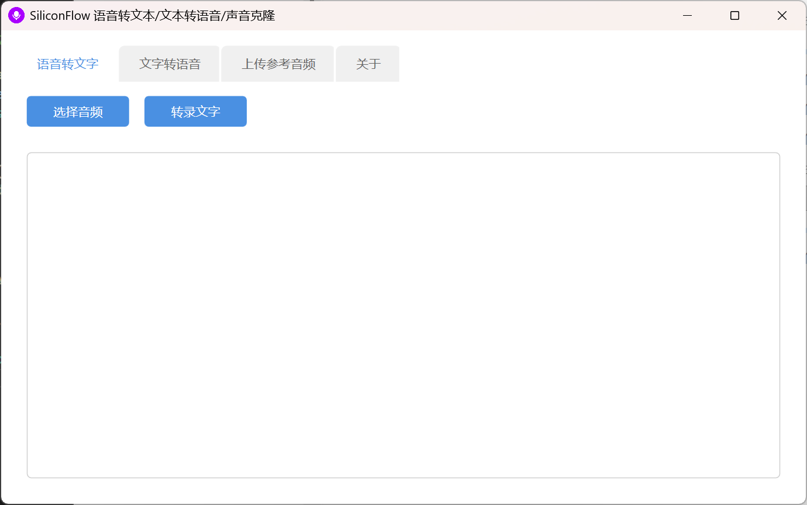
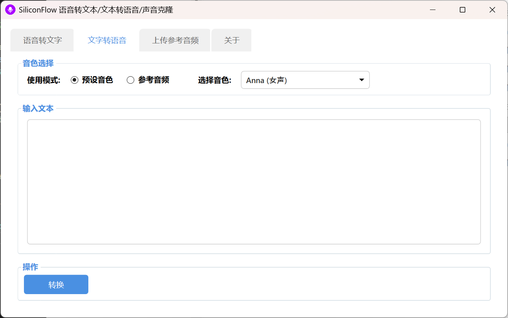
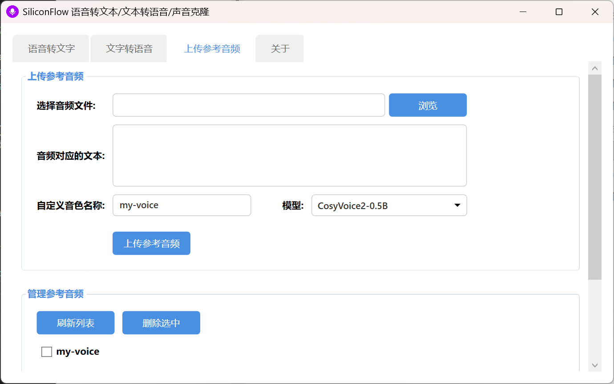
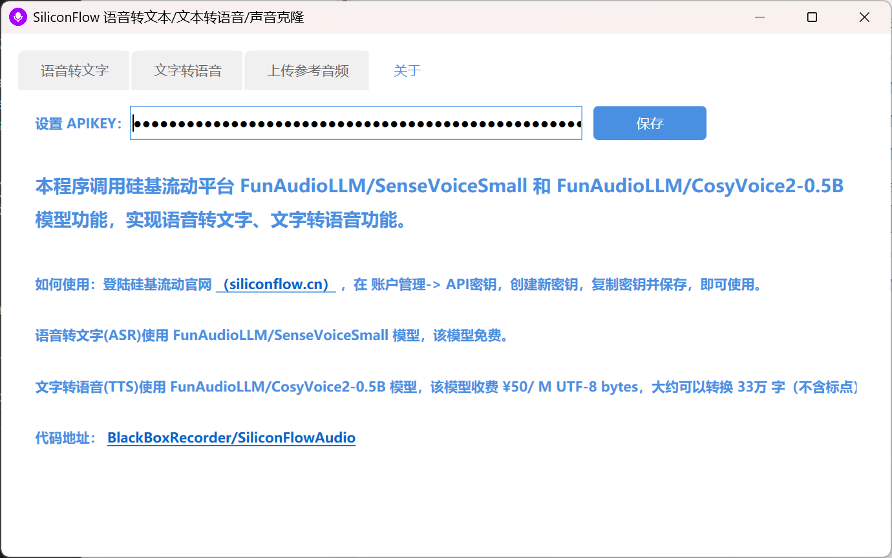

# SiliconFlowAudio

基于 [SiliconFlow (硅基流动)](https://siliconflow.cn/) API 开发的音频处理工具。集成了语音转文字 (ASR)、文本转语音 (TTS) 以及声音克隆功能。

## 🚀 核心功能

1.  **语音转文字 (ASR)**：使用 `FunAudioLLM/SenseVoiceSmall` 模型，支持快速准确的音频转录。
2.  **文本转语音 (TTS)**：使用 `FunAudioLLM/CosyVoice2-0.5B` 模型，支持多种预设音色及语速调节。
3.  **声音克隆**：支持上传参考音频创建自定义音色，实现个性化语音合成。
4.  **音色管理**：方便地管理已上传的自定义音色，支持刷新和删除操作。

## 📸 界面预览

### 语音转文字

### 文本转语音

### 声音克隆

### 软件设置

## 🛠️ 如何使用

1.  **获取 API Key**：访问 [SiliconFlow 官网](https://siliconflow.cn/)，在“账户管理 -> API密钥”中创建并复制您的 API 密钥。
2.  **配置软件**：运行程序，切换到“关于”选项卡，粘贴您的 API 密钥并点击保存。
3.  **开始使用**：
    *   在“语音转文字”中选择音频文件进行转录。
    *   在“文字转语音”中输入文本，选择音色（预设或参考音频）并转换。
    *   在“上传参考音频”中录制或选择一段音频（附带文本）来克隆您的声音。

## 📝 技术细节

*   **ASR 模型**：`FunAudioLLM/SenseVoiceSmall` (当前免费)
*   **TTS 模型**：`FunAudioLLM/CosyVoice2-0.5B`
*   **开发框架**：WPF (.NET)

---

**开源地址**：[BlackBoxRecorder/SiliconFlowAudio](https://github.com/BlackBoxRecorder/SiliconFlowAudio)